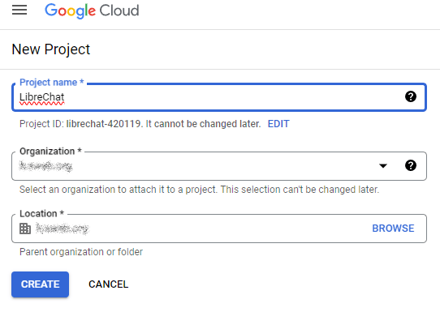
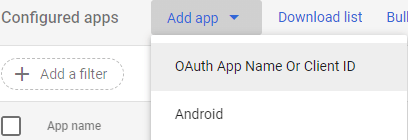
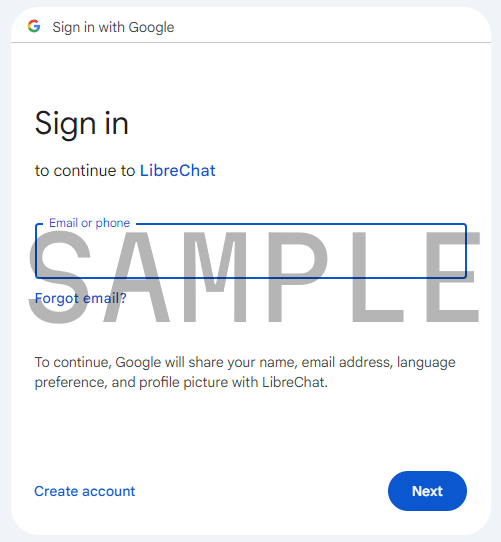

+++
title = "Hosting LibreChat, a FOSS LLM chat tool, with Caddy reverse proxy and Google SSO"
date = 2024-04-25
updated = 2024-04-26
[taxonomies]
tags = ["software", "IT", "cloud", "AI"]
[extra]
shorttitle = "Deploy LibreChat for cheap LLM queries"
toc = true
color = "#a5bc84"
+++

Do you want to deploy an inexpensive ChatGPT-like web app for your school, business, or friends?


LibreChat has a vast array of features and can utilize multiple LLM backends, but today we'll cover setting it up as a way to pay for OpenAI tokens rather than ChatGPT's flat fee. The official docs are available at [https://docs.librechat.ai](https://docs.librechat.ai)

## Prerequisites
1. At least one API key from a supported service such as OpenAI, Anthropic, Google Gemini
   1. this document assumes you have an OpenAI key with at least a couple bucks worth of credit
   2. alternatively, consider a custom endpoint using OpenRouter and one of their free models
2. A spare, preferably unused server with Linux, open to inbound internet traffic on ports 80 and 443
   1. a virtual machine or Raspberry Pi with Debian, Ubuntu, Red Hat, Oracle, or Rocky Linux
   2. Don’t care for on-prem? Inexpensive Virtual Private Servers can be found at [lowendbox.com](https://lowendbox.com/) or on Oracle Cloud’s [free tier](https://www.oracle.com/cloud/free/), or use your cloud compute flavor of choice.
3. A subdomain with an A record pointed at your server
   1. The subdomain makes it easy for us to set up secure access and single sign-on.
4. A Google Workspace domain to use for single sign-on

(The last three are optional; if you are so inclined, LibreChat can run locally on your Windows computer for testing.)

## Prepare your server

You’ll need to first install the latest official versions of [Docker Engine](https://docs.docker.com/engine/install/#supported-platforms) (for managing the LibreChat container) and [Caddy](https://caddyserver.com/docs/install) (to provide a reverse web proxy for security and performance, and enable automatic TLS certificate setup).

Create a service account and directory for LibreChat:

```sh
sudo -i # if you are not logged in as root
useradd -r -U librechat
groupadd docker
usermod -aG docker librechat
install -d -m 0755 -o librechat -g librechat /opt/librechat
```

## Deploy LibreChat and Caddy
Log in as the service account and set up LibreChat
```sh
sudo -i -u librechat
cd /opt/librechat
git clone https://github.com/danny-avila/LibreChat .
touch librechat.yaml # don’t need to configure these options yet
cp .env.example .env
# Generate secure keys for plugins
k32=$(hexdump -vn32 -e'8/4 "%08x" 1 "\n"' /dev/urandom)
i16=$(hexdump -vn16 -e'4/4 "%08x" 1 "\n"' /dev/urandom)
sed -i "s/^CREDS_KEY=.*/CREDS_KEY=$k32/g" .env
sed -i "s/^CREDS_IV=.*/CREDS_IV=$i16/g" .env
```

Edit your .env with your preferred terminal editor, for example:

```sh
nano .env
```

You'll want to modify these lines at least:

```sh
DOMAIN_CLIENT=https://subdomain.yourdomain.com
DOMAIN_SERVER=https://subdomain.yourdomain.com
ENDPOINTS=openAI,assistants,gptPlugins
OPENAI_API_KEY=your_openAI_key
OPENAI_MODELS=gpt-4-turbo,gpt-3.5-turbo
ASSISTANTS_API_KEY=same_key_as_above
ASSISTANTS_MODELS=gpt-4-turbo,gpt-3.5-turbo
PLUGINS_MODELS=gpt-4-turbo,gpt-3.5-turbo
DALLE_API_KEY=same_key_as_above
```

Start LibreChat and drop back into a root shell

```sh
docker compose up -d
exit
```

Configure Caddy to serve LibreChat. Open `/etc/caddy/Caddyfile` with an editor

```sh
nano /etc/caddy/Caddyfile
```

Replace the entire contents of the file with:

```caddyfile
subdomain.yourdomain.com {
	reverse_proxy localhost:3080
}
```

Now start Caddy

```sh
systemctl enable caddy --now
systemctl reload caddy
```

It should automatically retrieve a certificate and start serving as a reverse proxy for LibreChat.

You should now visit your subdomain, create an account with your email address and a new password, and test out the service. (The developers of the platform state that the first account created is automatically registered as an administrator, though there is not yet an administrative web interface.)

Issues? You may need to check your port forwarding, firewall settings, DNS on the client, server, and your nameservers, the caddy logs (`journalctl -u caddy --since today`), the LibreChat console output (`docker attach`).

## Setting up SSO through Google Workspace

Sign in to the Google Cloud Console and visit the [New Project](https://console.cloud.google.com/projectcreate) page. Set an appropriate project name and attach the project to your organization.



Go to APIs and Services > Credentials and click to **CONFIGURE CONSENT SCREEN**


**App information**

You’ll want to select Internal to only allow accounts in your Google Cloud domain to authenticate. Provide a name (suggested: LibreChat) and logo ([suggested](https://github.com/danny-avila/LibreChat/blob/main/docs/assets/favicon_package/android-chrome-192x192.png))

**App domain**

Ensure the **application home page** and **Authorized domains** are set to the subdomain you have pointed at LibreChat. Add your administrative email address as the **Developer contact information**.

**Scopes**

Add the following:

* `.../auth/userinfo.email`
* `.../auth/userinfo.profile`
* `openid`

After saving and completing the consent screen setup, return to the **Credentials** page, click **CREATE CREDENTIALS**, and create an Oauth client ID. You’ll want to set it as a Web application named LibreChat with authorized origin `https://subdomain.yourdomain.com` and authorized redirect URI `https://subdomain.yourdomain.com/oauth/google/callback`. Once you click CREATE, you will receive a client ID and client secret. You’ll then add them to your `.env` file:

```sh
nano /etc/librechat/.env
```

```sh
GOOGLE_CLIENT_ID=WHATEVER_GOOGLE_GAVE_YOU.apps.googleusercontent.com
GOOGLE_CLIENT_SECRET=LONG_RANDOM_STRING
GOOGLE_CALLBACK_URL=/oauth/google/callback

ALLOW_EMAIL_LOGIN=false
ALLOW_REGISTRATION=false
ALLOW_SOCIAL_LOGIN=true
ALLOW_SOCIAL_REGISTRATION=true
```

And you’ll need to add the app you created to Google Admin under the [Configured apps](https://admin.google.com/ac/owl/list?tab=configuredApps) section



Search for the Client ID provided by Google, select a scope of users allowed to access the application, and approve it. Now you can restart the service and, if all is well, will be able to sign in.

```sh
sudo -i -u librechat
cd /opt/librechat
docker compose restart
```




## Left as an exercise for the reader
The instructions above will get you up and running, but if you want a stable, secure, and correctly configured system, you’ll at least want to consider some of the following:
1. Review the full documentation for LibreChat and configured desired options
2. Create a [systemd unit file](https://askubuntu.com/questions/1459175/how-to-run-a-docker-compose-as-a-systemd-service) to automatically start LibreChat’s docker containers as the librechat user
3. Set up your distribution’s preferred firewall to disallow inbound connections to ports other than 80 and 443 (and SSH 22 from trusted addresses)
4. Install and configure fail2ban to protect your SSH logins if you publicly expose port 22
5. Configure some form of backups
