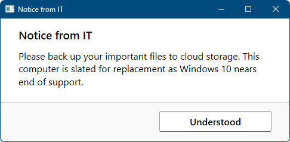

+++
title = "Windows 11-styled HTA dialogs"
date = 2025-07-17
updated = 2025-07-17
[extra]
color = "#09e0fe"
+++

Recently, I had to let some users know that we would be replacing their computers as part of a Windows 11
upgrade. I wanted to create a modern-looking notification popup, and I want to make sure that it wouldn't
display if we accidentally applied it to a Windows 11 user. I don't have a dark mode implemented or anything of the sort,
but I got as close as I could with the fonts, button, and button pane. Here's what I came up with:



And the code:

```html
<head>
<title>Notice from IT</title>
<HTA:APPLICATION
	APPLICATIONNAME="Notice from IT"
	ICON = "mmc.exe"
	SCROLL = "no"
	BORDER = "thick"
	BORDERSTYLE = "normal"
	INNERBORDER = "no"
	SELECTION = "no"
	CONTEXTMENU = "no"
	MAXIMIZEBUTTON = "no"
	SINGLEINSTANCE="yes"
/>
<meta http-equiv="x-ua-compatible" content="IE=11"/>
<style type="text/css">
	body{
		font-family: 'Segoe UI';
		padding: 0;
		margin: 0;
		cursor: default;
	}
	.toparea{
		background: #fff;
		padding: 10px 30px 10px;
	}
	.buttonarea{
		background: #f9f9f9;
		border-top: 1px solid #999;
		padding: 20px 30px 23px;
		text-align: right;
	}
	#ok {
		text-align: center;
		font-family: 'Segoe UI';
		font-size: 1em;
		border: 1px solid #999;
		border-bottom: 1px solid #555;
		border-radius: 3px;
		padding: 6px 50px;
		font-weight: 600;
		background: #fff;
		cursor: pointer;
	}
	#ok:hover {
		background: #1588f2;
		color: #fff;
	}
	h3 {
		margin: 5px 0 0;
		font-weight: 600;
	}
	p {
		margin: 12px 0 15px;
	}
</style>
<script type="text/javascript">
	var shell = new ActiveXObject("WScript.Shell");
	var strBuild = shell.RegRead("HKLM\\SOFTWARE\\Microsoft\\Windows NT\\CurrentVersion\\CurrentBuild");
	var buildNum = parseInt(strBuild, 10);
	if (!isNaN(buildNum) && buildNum >= 322000) {
	  window.close();
	}
	window.resizeTo(500,245);
</script>
</head>
<body>
<div class="toparea">
	<h3>Notice from IT</h3>
	<p>Please back up your important files to cloud storage. This computer is slated for replacement as Windows 10 nears end of support.
</div>
<div class="buttonarea">
	<a onclick="window.close()" id="ok">Understood</a>
</div>
<script type="text/javascript">
    window.resizeTo(500,245);
    window.focus();
    document.getElementById("ok").focus();
</script>
</body>
```

If you want the icon to display, you'll need to switch the meta tag to IE=9, but this causes the
dialog to briefly flicker at a larger window size on load which I found not to be worth the trade-off.

And of course you can remove the first script block if you want a notice that displays on any
Windows version.